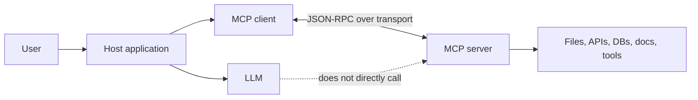
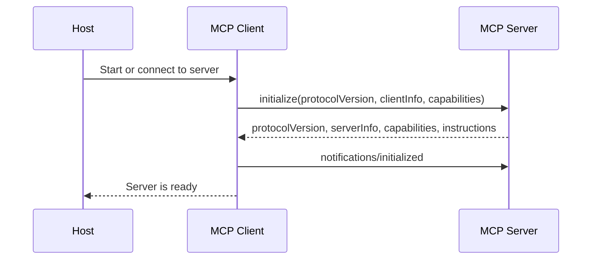
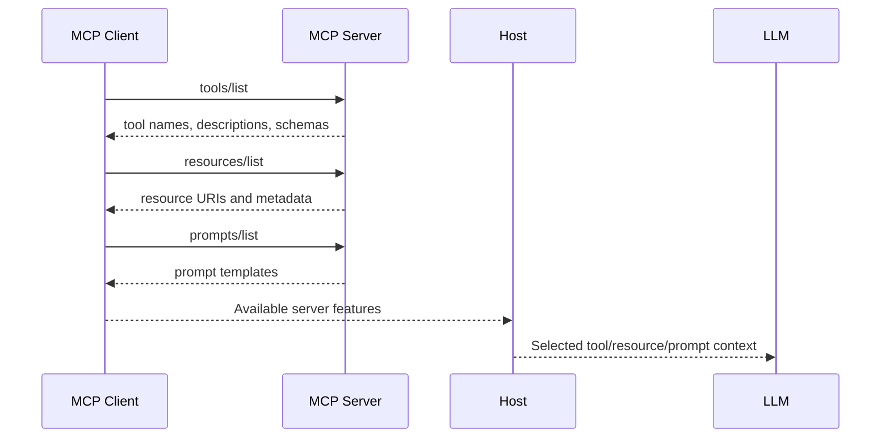
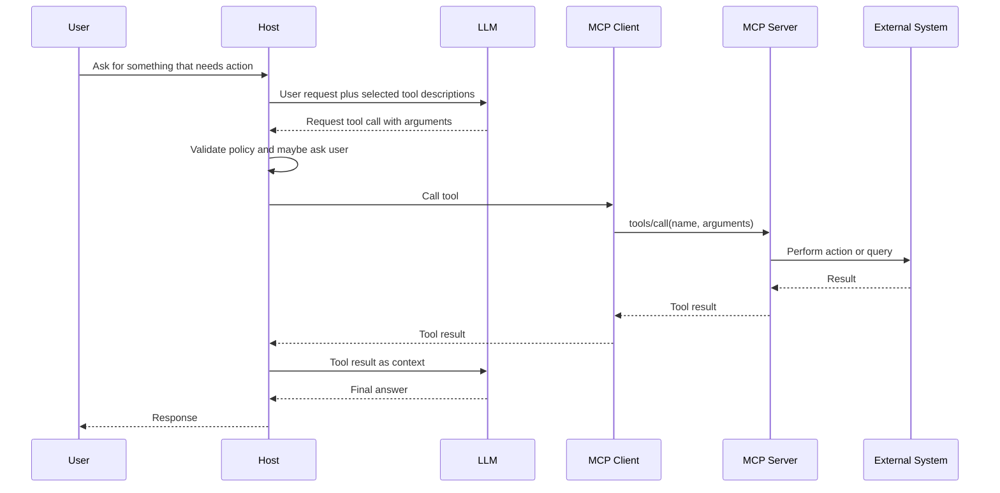
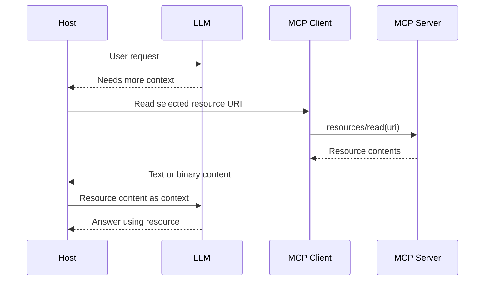
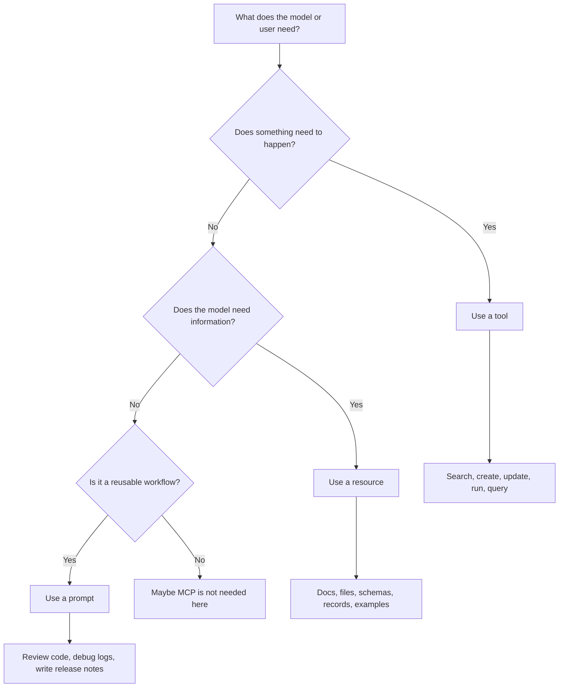
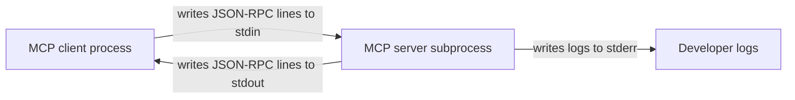
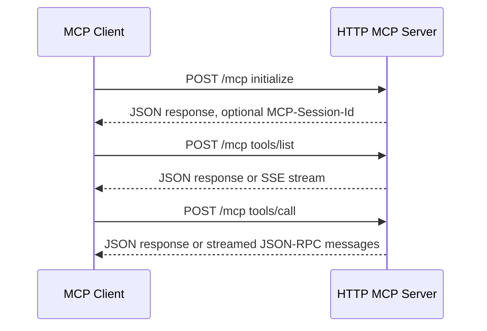
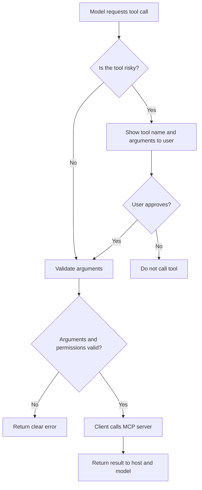
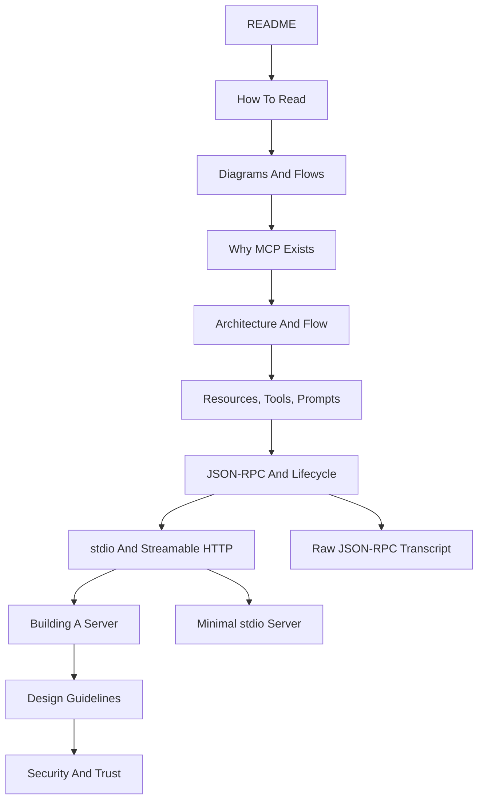

# Diagrams And Flows

This page gives you visual maps for MCP. Read it before the deep chapters, then
come back to it after reading the JSON-RPC examples.

GitHub renders these diagrams with Mermaid. If your editor does not render
Mermaid, read the labels from top to bottom.

## 1. The Big Picture

The most important MCP idea is the boundary between the model and the server.



Meaning:

- The user talks to the host application.
- The host talks to the LLM.
- The MCP client inside the host talks to MCP servers.
- The server exposes tools, resources, and prompts.
- The LLM may request a tool call, but the host and MCP client execute the MCP
  protocol call.

## 2. Startup vs Runtime

MCP has two different moments that are easy to mix up:

- **Startup**: the client discovers what the server can do.
- **Runtime**: the user asks something, the model requests a tool call, and the
  client calls the server.

Startup:

```text
          Startup
             |
             v

MCP Client ---------> MCP Server
    |                    |
    |<---- Tool List ----|
    |
    v
Store Tool Metadata
```

Runtime:

```text
          Runtime
             |
             v

User
 |
 v
LLM
 |
 | Tool Call Request
 v
MCP Client
 |
 v
MCP Server
 |
 | Tool Result
 v
MCP Client
 |
 v
LLM
 |
 v
User
```

What this teaches:

- Tool discovery happens before the user asks for a tool call.
- The client stores tool metadata such as names, descriptions, and schemas.
- At runtime, the LLM asks for a tool call through the host.
- The MCP client calls the MCP server and gives the result back to the LLM.
- The user only sees the final answer unless the host UI also shows tool steps.

## 3. Startup And Initialization

Before the client can call tools or read resources, the connection is
initialized.



What this teaches:

- The client starts the protocol with `initialize`.
- The server declares what it supports.
- The client sends `notifications/initialized`.
- Normal requests begin after initialization.

## 4. Discovery Flow

MCP servers are discoverable. The client does not need to hard-code every tool
or resource before connecting.



What this teaches:

- The MCP server tells the client what exists.
- The host chooses what to expose to the model.
- The model sees descriptions and context selected by the host, not a raw server
  connection.

## 5. Tool Call Flow

Tools are actions. A model can decide a tool is useful, but the host still
controls execution.



What this teaches:

- `tools/call` is sent by the MCP client, not directly by the LLM.
- The host can block, approve, or modify what happens.
- Tool results go back to the model through the host.

## 6. Resource Read Flow

Resources are context. Reading a resource should not perform a risky action.



What this teaches:

- Use resources for docs, schemas, files, and examples.
- Long background material belongs in resources, not tool descriptions.
- The host chooses which resource content enters the model context.

## 7. Tool, Resource, Or Prompt?

Use this decision flow when designing a server.



What this teaches:

- Tools are for actions.
- Resources are for context.
- Prompts are for reusable workflows.

## 8. stdio Transport

stdio is common for local development. The server is usually a subprocess.



Rules:

- One JSON-RPC message per line.
- stdin receives client messages.
- stdout sends server protocol messages.
- stderr is for logs.
- Do not print normal logs to stdout.

## 9. Streamable HTTP Transport

Streamable HTTP is useful for remote or independently hosted MCP servers.



What this teaches:

- The JSON-RPC message shape stays the same.
- HTTP is the delivery mechanism.
- Servers may use sessions.
- SSE can stream messages when work takes time.

## 10. Safety Flow For Risky Tools

Risky tools should go through policy checks and user approval.



Risky tools include:

- deleting data
- deploying code
- sending messages
- changing permissions
- running shell commands
- spending money
- exporting private data

## 11. One Full Learning Map

Use this map to connect the course pages.



If you get lost, return to this page and identify where you are in the flow.
